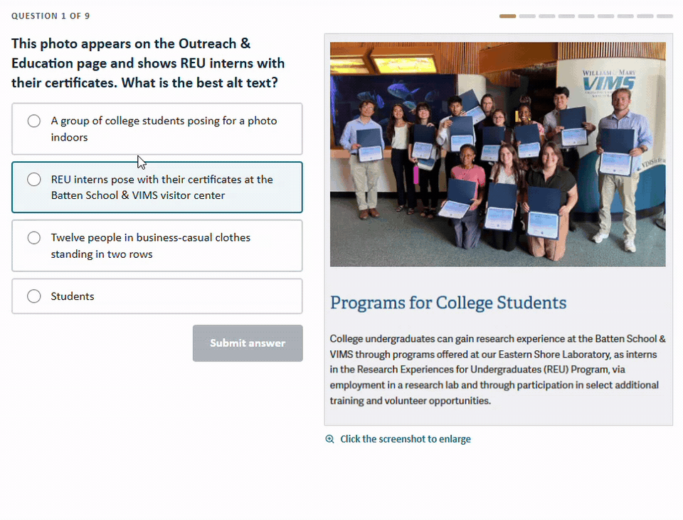

# Alt Text Quiz



An interactive quiz that teaches how to write good alt text, using real screenshots
from the VIMS website. Static, framework-free (HTML/CSS/JS) — no build step, designed
to be deployed as a GitHub Pages site and embedded elsewhere.

**Live at:** <https://www.vims.edu/intranet/comms_marketing/web_policy/digital-accessibility/alt-text-quiz/>

## Run locally

Just open `index.html` in a browser. (No server required, though a simple static
server avoids any browser file:// quirks: `python3 -m http.server` then visit
<http://localhost:8000>.)

## Embed in a CMS

Drop in the iframe, and load `embed-parent.js` on the **host** page — a cross-origin
iframe can't resize itself or scroll its parent, so without that script you get a
scrollbar inside a scrollbar and "Next question" strands the reader.

```html
<iframe src="https://gam32bit.github.io/alt-text-quiz/?embed=1"
        title="Alt Text Quiz" width="100%" height="900"
        allow="clipboard-write" style="border:0; display:block; width:100%;"></iframe>
<script src="/path/to/embed-parent.js"></script>
```

- `?embed=1` drops the quiz's own start screen and card chrome and goes two-column on
  wide screens, so it sits on the host page as page content rather than a box.
- `allow="clipboard-write"` is required for the "Share quiz" button.
- Keep `height="900"` and don't add `scrolling="no"` — that's the fallback if the
  script never loads.
- Set `HEADER_OFFSET` in `embed-parent.js` (default `90`) to your site header's real
  height so scroll targets don't land underneath it.

If either end moves, update the origin constants that the `postMessage` handshake
checks: `PARENT_ORIGIN` in `quiz.js` and `QUIZ_ORIGIN` in `embed-parent.js`, plus
`CANONICAL_URL` in `quiz.js` (what "Share quiz" copies outside embed mode).

## Accessibility

The quiz is built to model good accessibility: keyboard-operable controls (including
Enter to submit an answer), visible focus styles, grouped radio options in a labelled
fieldset, focus moved to the feedback region after each answer so screen readers read it
in full, an `aria-live` region that announces the final score, correct/incorrect signaled
with text + symbols (not color alone), and a skip link. Each screenshot has alt text giving enough page context
to engage with the question without revealing the answer.
